# Rails-Avanzado

En un inicio la aplicacion no corre por que debemos crear la tabla moviegoer. Para hacer esto ejecutamos el siguiente comando

```Shell
rails generate model Moviegoer name:string provider:string uid:string
```

Una vez hecho esto ejecutamos `rake db:migrate` para correr nuestra migracion y tener la tabla creada correctamente.

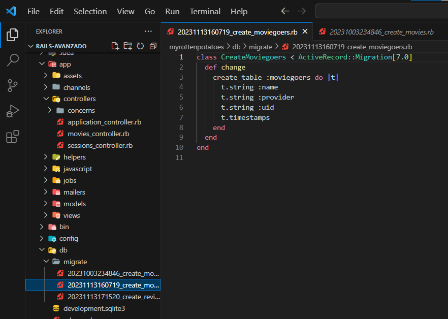
***
**Pregunta**
- Explica el código siguiente:
```Ruby
class MoviesController < ApplicationController
  # 'index' and 'show' methods from Section 4.4 omitted for clarity
  def new
    @movie = Movie.new
  end 
  def create
    if (@movie = Movie.create(movie_params))
      redirect_to movies_path, :notice => "#{@movie.title} created."
    else
      flash[:alert] = "Movie #{@movie.title} could not be created: " +
        @movie.errors.full_messages.join(",")
      render 'new'
    end
  end
  def edit
    @movie = Movie.find params[:id]
  end
  def update
    @movie = Movie.find params[:id]
    if (@movie.update_attributes(movie_params))
      redirect_to movie_path(@movie), :notice => "#{@movie.title} updated."
    else
      flash[:alert] = "#{@movie.title} could not be updated: " +
        @movie.errors.full_messages.join(",")
      render 'edit'
    end
  end
  def destroy
    @movie = Movie.find(params[:id])
    @movie.destroy
    redirect_to movies_path, :notice => "#{@movie.title} deleted."
  end
  private
  def movie_params
    params.require(:movie)
    params[:movie].permit(:title,:rating,:release_date)
  end
end
```
El `MoviesController` presenta métodos que gestionan las operaciones CRUD para el modelo Movie. 

El método `new` inicializa una nueva instancia de `Movie`, mientras que `create` maneja la creación de una película, redirigiendo a la página de índice en caso de éxito y mostrando mensajes de alerta en caso de errores.

El método `edit` prepara la edición de una película existente, y `update` gestiona la actualización de los detalles de una película, redirigiendo o mostrando alertas según el resultado.

Por último, `destroy` elimina una película por su ID y redirige a la página de índice. El método privado `movie_params` especifica los atributos permitidos para la creación o actualización, proporcionando una capa de seguridad en la manipulación de datos.

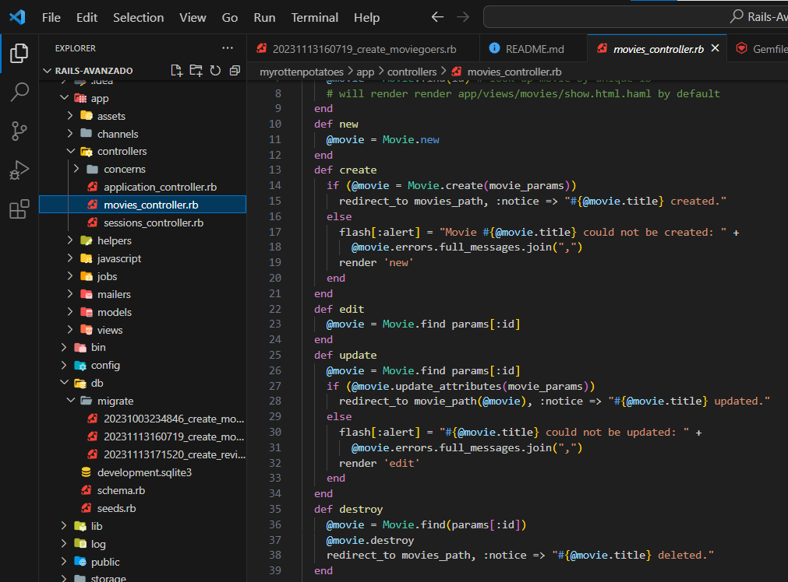
***

Se puede autenticar al usuario a través de un tercero. Usar la excelente gema OmniAuth que proporciona una API uniforme para muchos proveedores de SSO diferentes. El código siguiente muestra los cambios necesarios en sus rutas, controladores y vistas para usar OmniAuth.

1. Primero añadimos las gemas `omniauth` y `omniauth-twitter` en nuestro gemfile y las instalamos con

```shell
bundle install
```

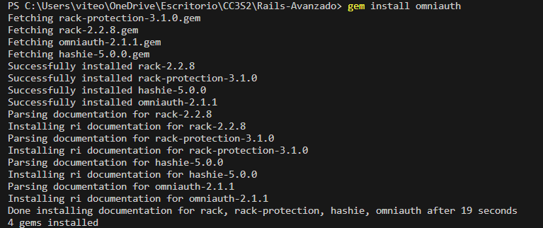
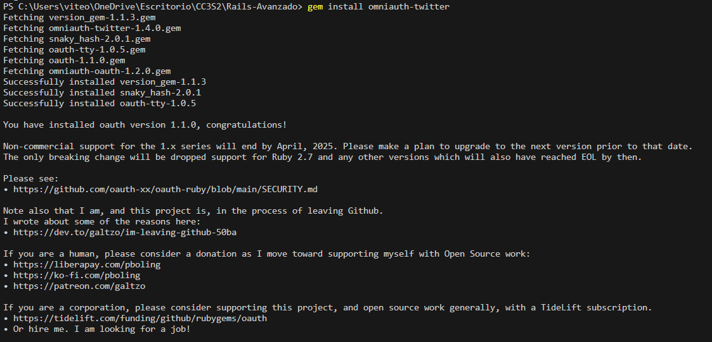

2. Creamos el archivo `sessions_controller.rb` dentro de la carpeta `controllers` e insertamos el siguiente código

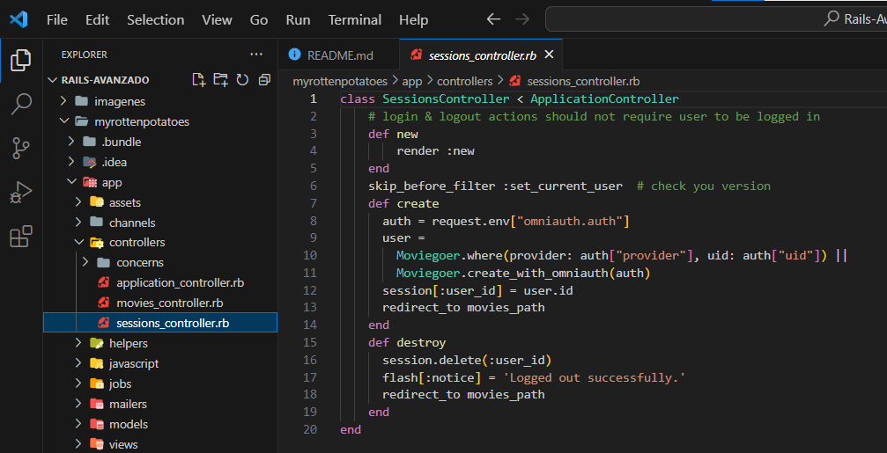
```Ruby
class SessionsController < ApplicationController
    # login & logout actions should not require user to be logged in
    def new
        render :new
    end
    skip_before_filter :set_current_user  # check you version
    def create
      auth = request.env["omniauth.auth"]
      user =
        Moviegoer.where(provider: auth["provider"], uid: auth["uid"]) ||
        Moviegoer.create_with_omniauth(auth)
      session[:user_id] = user.id
      redirect_to movies_path
    end
    def destroy
      session.delete(:user_id)
      flash[:notice] = 'Logged out successfully.'
      redirect_to movies_path
    end
end
```

3. Definimos las rutas en `config/routes.rb`

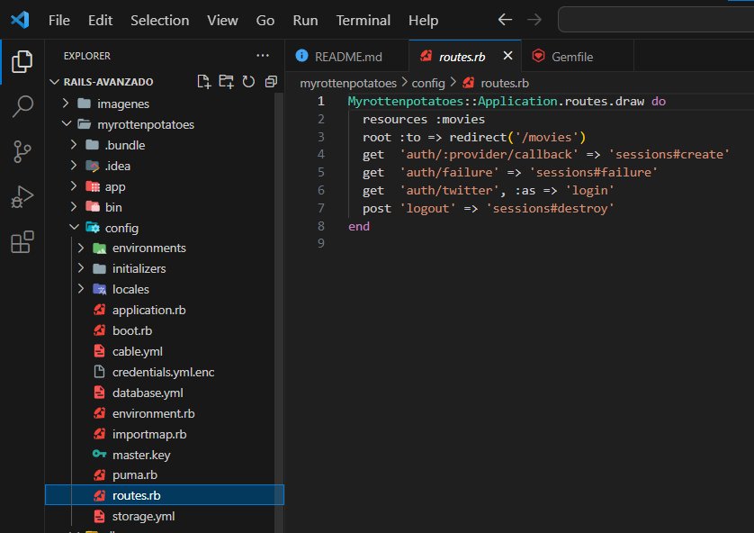

```Ruby
get  'auth/:provider/callback' => 'sessions#create'
get  'auth/failure' => 'sessions#failure'
get  'auth/twitter', :as => 'login'
post 'logout' => 'sessions#destroy'
```

4. Por último creamos el archivo `omniauth`.rb con nuestras apis dentro de los `initializers` para que la aplicación se ejecute con esta `config`

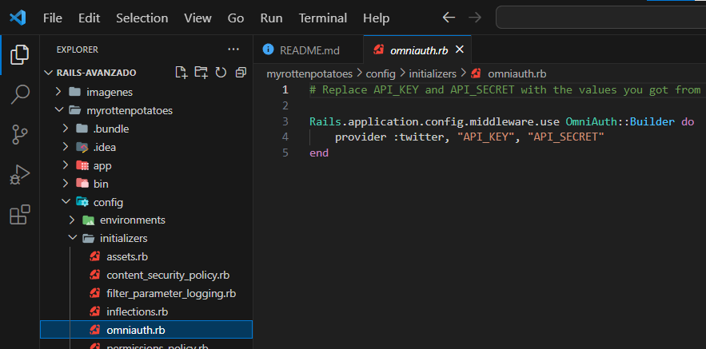
```Ruby
Rails.application.config.middleware.use OmniAuth::Builder do
  provider :twitter, "API_KEY", "API_SECRET"
end
```

***
**Pregunta**
- ¿Qué sucede si un atacante malintencionado crea un envío de formulario que intenta modificar `params[:moviegoer][:uid]` o `params[:moviegoer][:provider]` (campos que solo deben modificarse mediante la lógica de autenticación) publicando campos de formulario ocultos denominados `params[moviegoer][uid]` y así sucesivamente?.

Esto podría conducir a un ataque de manipulación de parámetros. En un ataque de manipulación de parámetros, un atacante intenta modificar los valores de los parámetros que se envían en una solicitud, ya sea agregando parámetros adicionales, eliminando parámetros existentes o modificando sus valores. 

En este caso, si el controlador no valida adecuadamente los parámetros recibidos y confía ciegamente en los datos proporcionados por el formulario, el atacante podría modificar indebidamente campos importantes relacionados con la autenticación.

***
**Pregunta**


- Explica las siguientes lineas de SQL
```SQL
SELECT reviews.*
    FROM movies JOIN reviews ON movies.id=reviews.movie_id
    WHERE movies.id = 41;
```

El código tiliza una cláusula ``JOIN`` para combinar las tablas `movies` y `reviews` en base a la igualdad entre el ID de la película en la tabla `movies` y el ID de la película en la tabla `reviews`.

La cláusula `WHERE` posterior filtra los resultados para incluir solo las revisiones asociadas a la película con el ID 41 en la tabla `movies`.

***

Crea y aplica esta migración para crear la tabla `Reviews`. Las claves foraneas del nuevo modelo están relacionadas con las tablas `movies` y `moviegoers` existentes por convención sobre la configuración.

1. Para crear la tabla `Reviews` primero generamos la migración

```shell
rails generate migration create_reviews'
```

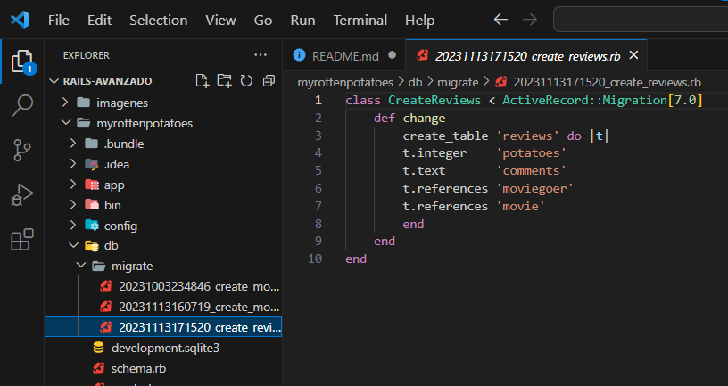

2. Una vez creada ejecutamos

```shell
rake db:migrate
```

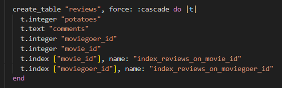

3. Creamos el nuevo modelo de revisión dentro de `app/models/review.rb`

```Ruby
class Review < ActiveRecord::Base
    belongs_to :movie
    belongs_to :moviegoer
end
```

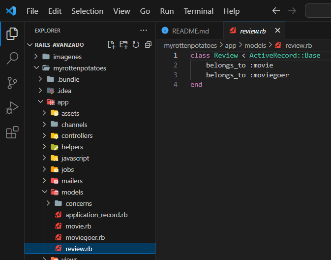

4. Por último colocamos una copia de la siguiente línea en cualquier lugar dentro de la clase `Movie` Y dentro de la clase `Moviegoer`, es decir realiza este cambio de una línea en cada uno de los archivos existentes movie.rb y moviegoer.rb.

```ruby
has_many :reviews
```

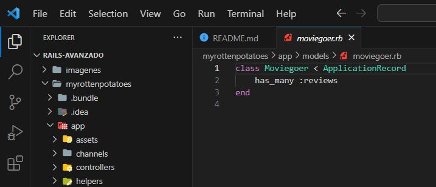
***

**Pregunta**

- ¿Qué indica el siguiente código SQL ?

```SQL
SELECT movies .*
    FROM movies JOIN reviews ON movies.id = reviews.movie_id
    JOIN moviegoers ON moviegoers.id = reviews.moviegoer_id
    WHERE moviegoers.id = 1;
```

La consulta SQL `SELECT movies.*` busca seleccionar todas las columnas de la tabla `movies` para aquellas películas que han sido revisadas por el usuario identificado con el ID 1.

Se establece una relación entre las tablas `movies` y `reviews` mediante una unión basada en la coincidencia de los IDs de película. Luego, se establece otra relación con la tabla `moviegoers` utilizando la coincidencia de los IDs de usuario entre las tablas `moviegoers` y `reviews`.

La cláusula `WHERE moviegoers.id = 1` filtra los resultados para incluir solo las películas asociadas a las revisiones del usuario con el ID 1 en la tabla `moviegoers`.
***


